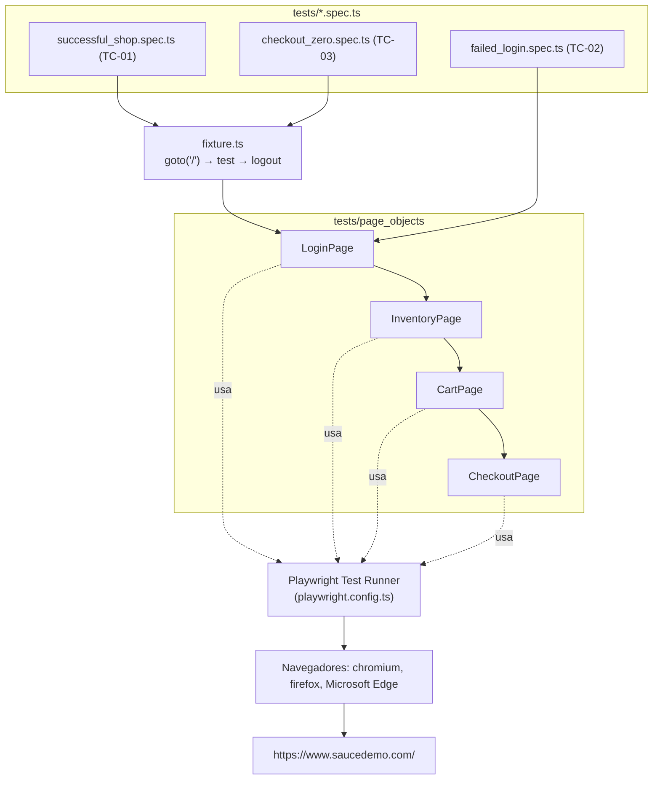

# saucedemo_ai_automated_testing

## Descripción

Este repositorio contiene un conjunto de pruebas automatizadas de extremo a extremo (E2E) para el
sitio de demostración [Sauce Demo](https://www.saucedemo.com/), construidas con **Playwright** y
**TypeScript**, usando prompting con la herramienta de IA **Claude**.

Los casos de prueba, el mapeo de localizadores y los specs automatizados fueron generados de forma
iterativa a partir de prompts documentados en el propio repositorio (ver
[Estructura de carpetas](#estructura-de-carpetas)), lo que permite trazar cada archivo del proyecto
hasta la instrucción de IA que lo originó.

## Prerrequisitos

- Node.js 26
- Instalar dependencias con: `npm i`
- Instalar los navegadores de Playwright con: `npx playwright install`

## Instalación

1. Clonar el repositorio.
2. Ejecutar `npm i` para instalar las dependencias del proyecto.
3. Ejecutar `npx playwright install` para descargar los binarios de Chromium, Firefox y Microsoft Edge.

## Estructura de carpetas

```
.
├── .github/
│   ├── prompts/
│   │   └── PROMPTS.md              # Prompts usados con Claude para generar la matriz de casos
│   │                                # de prueba (Fase 0), el mapeo de localizadores (Fase 1) y la
│   │                                # implementación de cada spec automatizado (Fases 2-4).
│   └── workflows/
│       └── playwright.yml          # Pipeline de CI (GitHub Actions).
├── docs/
│   ├── test-cases-checkout-e2e.md  # Matriz de casos de prueba (TC-01, TC-02, TC-03) resultante
│   │                                # de la Fase 0 del prompt: feature, precondiciones y
│   │                                # escenario Gherkin de cada caso.
│   └── fixes.md                    # Registro de incidencias y soluciones. Documenta, por ejemplo,
│                                    # la corrección del localizador de "Logout" en fixture.ts, que
│                                    # usaba `getByRole('link', ...)` cuando el elemento real es un
│                                    # `<a role="button">` (rol ARIA accesible = "button").
├── tests/
│   ├── fixture.ts                  # Fixture custom que abre la página principal antes del test
│   │                                # y cierra sesión al finalizar.
│   ├── page_objects/
│   │   ├── LoginPage.ts
│   │   ├── InventoryPage.ts
│   │   ├── CartPage.ts
│   │   └── CheckoutPage.ts
│   ├── successful_shop.spec.ts     # TC-01: Happy Path - Compra exitosa E2E
│   ├── failed_login.spec.ts        # TC-02: Login con usuario bloqueado
│   └── checkout_zero.spec.ts       # TC-03: Checkout completado sin items (total $0.00)
├── playwright-report/              # Reporte HTML generado tras cada ejecución.
├── playwright.config.ts
└── package.json
```

## Arquitectura de la automatización

El proyecto sigue el patrón **Page Object Model (POM)**: cada pantalla de la aplicación se modela
como una clase que expone sus localizadores y las acciones que se pueden realizar sobre ella. Los
archivos `*.spec.ts` no contienen localizadores directamente (salvo excepciones puntuales); en su
lugar, orquestan las page objects para describir el flujo de negocio en un lenguaje cercano al de
un caso de prueba.

El flujo E2E feliz (`successful_shop.spec.ts`) y el de checkout en cero (`checkout_zero.spec.ts`)
usan además el fixture custom (`tests/fixture.ts`), que abre `https://www.saucedemo.com/` antes del
test y cierra sesión al finalizar, garantizando el aislamiento entre pruebas. El test de login
fallido (`failed_login.spec.ts`) no usa el fixture, ya que el escenario nunca llega a iniciar sesión.



## Cómo ejecutar todas las pruebas

- Comando nativo: `npx playwright test`
- Comando personalizado (script en `package.json`): `npm run test` o `npm test`

**Resultado esperado:**
- Playwright ejecutará el conjunto de pruebas en la carpeta `tests` en los proyectos `chromium`,
  `firefox` y `Microsoft Edge` configurados en `playwright.config.ts`.
- Se generará un reporte HTML en la carpeta `playwright-report`.
- En local, las pruebas se ejecutan con el navegador visible (`headless: false`); en CI se ejecutan
  en modo headless y se reintentan una vez si fallan (ver [Configuración de Playwright](#configuración-de-playwright)).

## Cómo ejecutar una prueba específica

- Por archivo: `npx playwright test tests/successful_shop.spec.ts`
- Por nombre de prueba: `npx playwright test tests/successful_shop.spec.ts -g "compra exitosa"`
- Por proyecto/navegador: `npx playwright test --project=firefox`

## Cómo ver el reporte HTML

- Ejecutar el servidor de reportes local con: `npx playwright show-report`
- Abrir directamente en el navegador el archivo: `playwright-report/index.html`
- En GitHub Actions, los artefactos de reporte se descargan desde el job que ejecutó las pruebas
  (artefacto `playwright-report`, ver [Reportes y artefactos](#reportes-y-artefactos)).

## Diseño y decisiones técnicas

### Estructura del Page Object Model (POM)

Se utiliza la carpeta `tests/page_objects` para centralizar los localizadores y acciones de cada
pantalla:

- **LoginPage.ts**: localizadores del formulario de login (`Username`, `Password`, botón `Login`,
  mensaje de error) y del título "Products" de la siguiente pantalla. Expone `login()` para
  autenticarse y `isLoginSuccessful()`, que espera y valida que el título de Inventory esté visible
  para confirmar el flujo hacia la siguiente pantalla.
- **InventoryPage.ts**: localizadores del catálogo de productos, el combo de orden, el ícono/badge
  del carrito y el título "Your Cart" de la siguiente pantalla. Expone `addProductToCart()`,
  `removeProductFromCart()`, `getProductPrice()`, `sortBy()`, `goToCart()` y
  `isCartPageDisplayed()`, que valida la navegación exitosa al carrito.
- **CartPage.ts**: localizadores de los ítems del carrito, botón `Checkout`, `Continue Shopping` y
  el título "Checkout: Your Information" de la siguiente pantalla. Expone `removeItem()`,
  `getItemCount()`, `isEmpty()`, `goToCheckout()` y `isCheckoutPageDisplayed()`.
- **CheckoutPage.ts**: agrupa los tres pasos del checkout (información, overview y confirmación).
  Expone `fillCheckoutInfo()`, `continueToOverview()`, `isOverviewDisplayed()`, `getTotalAmount()` /
  `getTotal()` para validar el total de la compra, `finishCheckout()` e `isOrderComplete()`.

### Estrategia de localización

- Se favorece `getByRole` (y `getByText` para títulos de pantalla) para simular mejor la
  interacción humana y la accesibilidad, por ejemplo:
  `page.getByRole('textbox', { name: 'Username' })`, `page.getByRole('button', { name: 'Login' })`.
- Donde no es posible usar roles accesibles, se combinan localizadores CSS y atributos propios de
  la aplicación (`data-test`), por ejemplo: `[data-test="error"]`, `[data-test="total-label"]`,
  `.shopping_cart_badge`, `.inventory_item`, `.cart_item`.
- Ver [`docs/fixes.md`](docs/fixes.md) para un caso real donde un `getByRole('link', ...)` fallaba
  porque el elemento (`<a role="button">Logout</a>`) tiene un rol ARIA explícito que sobreescribe
  el rol implícito de la etiqueta `<a>`; la lección aplicada fue verificar el rol ARIA real en el
  DOM antes de asumir que el problema es de timeout.

### Fixtures y aislamiento de pruebas

`tests/fixture.ts` extiende `test` de Playwright con un fixture `fixtures` que:

- Abre `/` (página principal de Saucedemo) **antes** de los tests que lo requieren.
- Al finalizar el test, abre el menú lateral (`Open Menu`) y cierra sesión con el botón `Logout`.

Esto ayuda a mantener las pruebas aisladas y a evitar dependencias entre casos. Se usa en
`successful_shop.spec.ts` y `checkout_zero.spec.ts`; `failed_login.spec.ts` usa el `test` base de
Playwright porque el login nunca llega a completarse.

### Configuración de Playwright

En `playwright.config.ts` se configura:

- `timeout` global de 30 segundos.
- `expect.timeout` de 5 segundos.
- `fullyParallel: true` para ejecutar archivos en paralelo localmente.
- `forbidOnly` habilitado en CI, para evitar que un `test.only` llegue al pipeline.
- `retries: 1` solo en CI.
- `workers: 1` en CI para evitar ejecutarse en paralelo contra el mismo entorno compartido.
- Reporteador HTML y reporte de lista.
- Captura de pantallas solo en fallos: `screenshot: 'only-on-failure'`.
- `headless: !!process.env.CI`: en local se ejecuta con el navegador visible; en GitHub Actions
  (donde `CI` está definido automáticamente por el runner) se ejecuta en modo headless, evitando la
  dependencia de una granja de dispositivos.
- Proyectos para `chromium`, `firefox` y `Microsoft Edge` (`channel: 'msedge'`); `webkit` queda
  comentado como referencia.

## Integración continua

El pipeline se define en [`.github/workflows/playwright.yml`](.github/workflows/playwright.yml).

### Condiciones de ejecución

- Se ejecuta en `push` a `main` o `master`.
- También se puede disparar manualmente con `workflow_dispatch`.
- Se ejecuta de forma programada los viernes a las 15:00 UTC (`cron: "00 15 * * FRI"`).

### Estrategia de matriz

- Se usa un `matrix` para correr en paralelo tres comandos de prueba, uno por spec:
  - `npx playwright test successful_shop.spec.ts`
  - `npx playwright test failed_login.spec.ts`
  - `npx playwright test checkout_zero.spec.ts`
- `fail-fast: false` para que el fallo de un spec no cancele la ejecución de los demás.

### Reportes y artefactos

- Se ejecuta en `ubuntu-latest`, con `timeout-minutes: 60`.
- Se instala Node 26 y los navegadores de Playwright (`npx playwright install --with-deps`) en el runner.
- Se sube la carpeta `playwright-report/` como artefacto con `actions/upload-artifact@v7`.
- Los reportes se conservan durante 1 día (`retention-days: 1`).

## Autor

- David Alexander Rubio Baron
- davalexer93@gmail.com
- https://github.com/davalexer93
